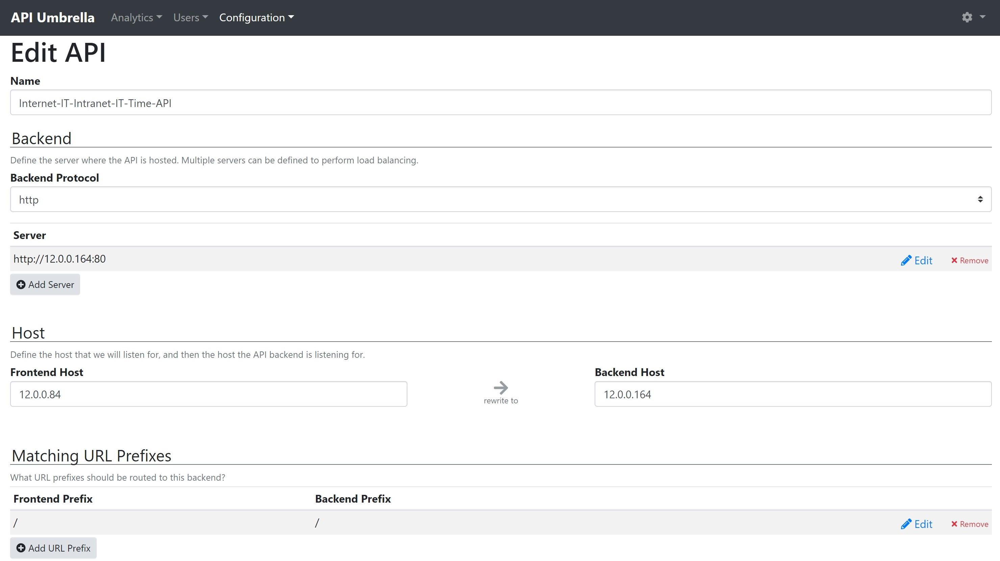
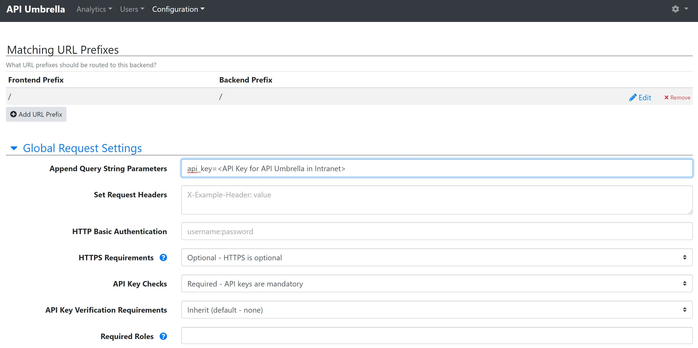

# Integration Server
Integration Server act is a gateway for cross-zone communication. In this sample, we use open source API Gateway - [API Umbrella](https://apiumbrella.io/).

### Installation
The installation is easy in Ubuntu, full setup can be found [here](https://api-umbrella.readthedocs.io/en/latest/getting-started.html).

Alternatively, you can run the script below.

```sh
wget
sudo sh api-umbrella.sh
```

### Setup
For first usage, admin will need to create an account. Account creation can be done in <ip address>/admin.

Process to register API in API Umbrella is simple. You will need to give your API a name, the frontend and backend server that the api gateway is listening to, and advance settings such as url-rewriting, modify web request etc(if required).

API Umbrella requires users to provide api_key in all web request, regardless of API operation.

The following is the sample setup:


The setup for integration server in intranet is similar. In this sample, API Umbrella in internet zone initiates request to API Umbrella in intranet zone, hence admin need to rewrite the web request with additional query to include api_key.



