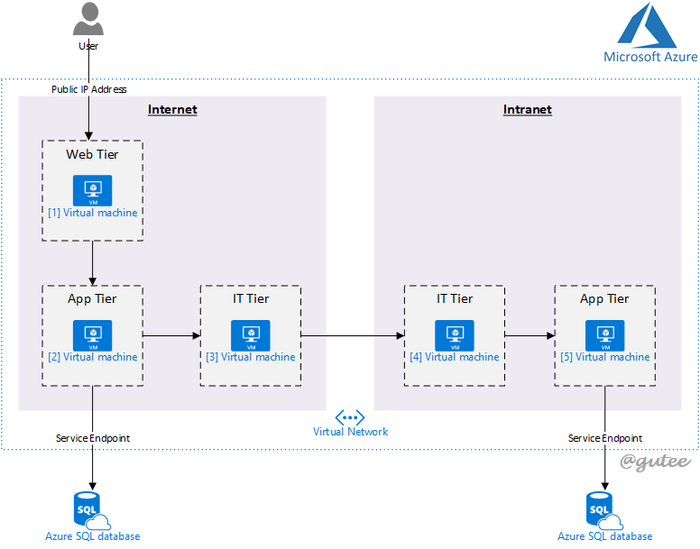

# LatencyApp
This is a simple web app to illustrate a 3-tier architecture data flow, and cross-zone communication to identify request latency in both zone.

The following architecture diagram illustrate the data flow:

### Data Flow
##### Internet zone
User acess web tier directly, initiate request to hit API app in App server, which then retrieve data from database server.

##### Intranet zone
User access web tier directly, initaite request to hit API app in App server, which then redirect request to integration server in internet zone, and subsequently intranet zone, and routed to app server in intranet zone, before hitting intranet zone database.

### Technology Stack
This sample uses [Microsoft Azure](https://azure.microsoft.com/en-us/) as cloud infrastructure. Various open source tecnologies are used in respective components.

#### Web Server
The web server uses [ASP.NET Core 3](https://docs.microsoft.com/en-us/aspnet/core/?view=aspnetcore-3.0), an open source, cross platform framework to build cloud-based web application.

Docker supports ASP.Net Core, hence this sample dockerize the image and run in docker environment.

#### App Server
The app server is a simple flask Python app, and expose web services as API for Web Server to consume. There are many ways to host flask python app, but the easiest way (used in this sample) is to dockerize the image and run in docker environment.

#### Integration Server
In this sample, [API Umbrella](https://apiumbrella.io/) is used. Details can be found in Integration Server.

#### Database Server
This sample leverage on [Azure SQL Database](https://azure.microsoft.com/en-us/services/sql-database/), a cloud native, Platform-As-A-Service database, which simplifies deployment and management.

### Demo
Demo site can be found [here](http://latency.tgynow.com/).

### Extra
To setup the infrastructure, there's a sample repository created, which leverages on [Terraform](https://www.terraform.io/). The repository can be located [here](https://github.com/guangying94/IaC-Terraform).